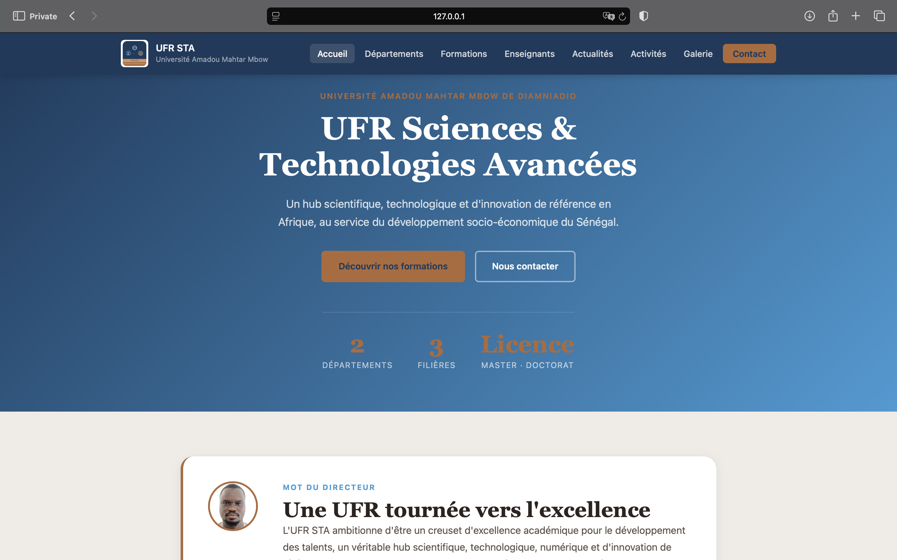
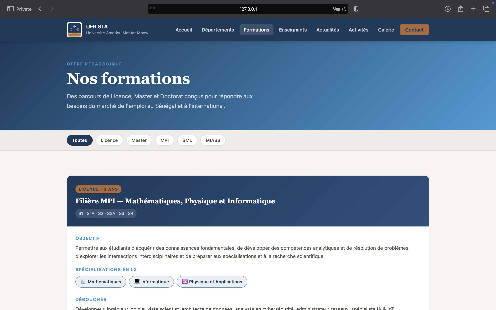
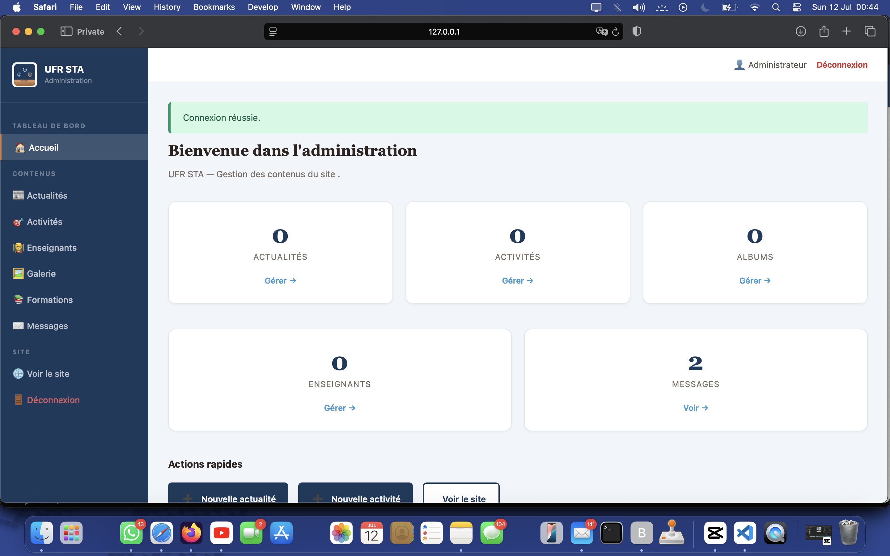
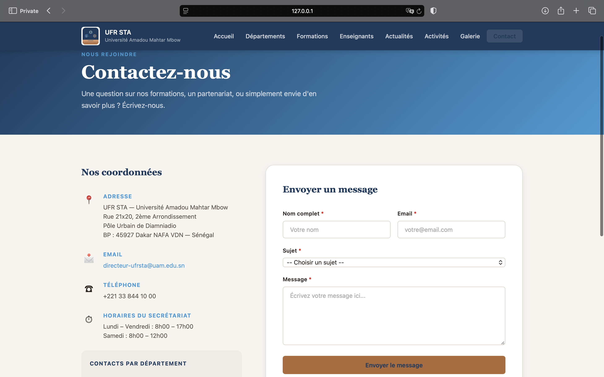

# Site Web Vitrine — UFR STA

### Université Amadou Mahtar Mbow De Diamniadio

Projet final du cours de **Programmation Web : HTML5, CSS3 & Fondamentaux Web**
Encadrant : Dr Lamine YADE | Date limite : **12 Juillet 2026**
Etudiants: **Pape Ndiaga Niang. Ciré Dramé.**

---

## Présentation

Ce projet est un site vitrine pour l'UFR Sciences, Technologies & Numérique (STA) de l'Université Alioune Diop de Bambey.
Il présente l'UFR, ses formations, ses départements, ses actualités et ses activités, et offre une interface d'administration pour gérer le contenu.

## Fonctionnalités principales

- Page d'accueil avec actualités récentes
- Présentation des départements
- Liste des formations
- Section actualités
- Section activités
- Galerie photo
- Page des enseignants
- Formulaire de contact enregistré en base de données
- Interface d'administration sécurisée pour gérer les actualités, les activités, les albums et les messages

## Technologies utilisées

- Python 3
- Flask
- HTML5
- CSS3
- JavaScript vanilla
- SQLite

## Installation et exécution

### Prérequis

- Python 3.8+ installé
- pip
- Git

### Étapes

1. Cloner le dépôt

```bash
git clone https://github.com/<votre-username>/ufr-sta.git
cd ufr-sta
```

2. Créer et activer l'environnement virtuel

```bash
python -m venv venv
source venv/bin/activate
```

3. Installer les dépendances

```bash
pip install -r files/requirements.txt
```

4. Initialiser la base de données (optionnel si déjà créée)

```bash
python -c "from app import init_db; init_db()"
```

5. Lancer l'application

```bash
python app.py
```

6. Ouvrir le site dans le navigateur

- Site public : http://127.0.0.1:5000
- Administration : http://127.0.0.1:5000/admin/login

### Identifiants admin par défaut

- Nom d'utilisateur : `admin`
- Mot de passe : `ufr2026`

## Structure du projet

```
ufr-sta/
├── app.py
├── database/
│   └── schema.sql
├── files/
│   ├── README.md
│   └── requirements.txt
├── static/
│   ├── css/
│   │   ├── admin.css
│   │   └── style.css
│   ├── images/
│   └── js/
│       └── main.js
└── templates/
    ├── activites.html
    ├── actualites.html
    ├── base.html
    ├── contact.html
    ├── departements.html
    ├── enseignants.html
    ├── formations.html
    ├── galerie.html
    ├── index.html
    └── admin/
        ├── activites.html
        ├── actualites.html
        ├── base_admin.html
        ├── dashboard.html
        ├── enseignants.html
        ├── form_activite.html
        ├── form_actualite.html
        ├── form_album.html
        ├── form_enseignant.html
        ├── form_formation.html
        ├── formations.html
        ├── galerie.html
        ├── login.html
        └── messages.html
```

## Base de données

Le projet utilise SQLite avec le schéma défini dans `database/schema.sql`.
Voici les tables principales :

- `departement`
- `formation`
- `actualite`
- `activite`
- `album`
- `photo`
- `enseignant`
- `contact_message`
- `admin`

## Routes principales

- `/` : page d'accueil
- `/departements` : page des départements
- `/formations` : page des formations
- `/actualites` : page des actualités
- `/activites` : page des activités
- `/galerie` : page galerie
- `/enseignants` : page des enseignants
- `/contact` : page de contact

## Administration

- `/admin/login` : connexion administrateur
- `/admin` : tableau de bord
- `/admin/actualites` : gestion des actualités
- `/admin/activites` : gestion des activités
- `/admin/galerie` : gestion des albums
- `/admin/formations` : gestion des formations

## Captures d’écran

Voici des captures d’écran du site :

- Page d'accueil
- Page des formations
- Tableau de bord admin
- Page de contact









## Notes

- Le mot de passe est stocké en clair dans la base de données. Pour la production, utilisez un hachage sécurisé.
- Le site est conçu pour un usage pédagogique et peut être étendu avec des fonctionnalités supplémentaires : upload d'images, pagination, filtres, authentification plus robuste.

## À propos

Site vitrine réalisé dans le cadre du cours de Programmation Web pour l'UFR STA de l'Université Alioune Diop de Bambey.

---

_UFR STA — Université Amadou Mahtar Mbow De Diamniadio © 2026_
